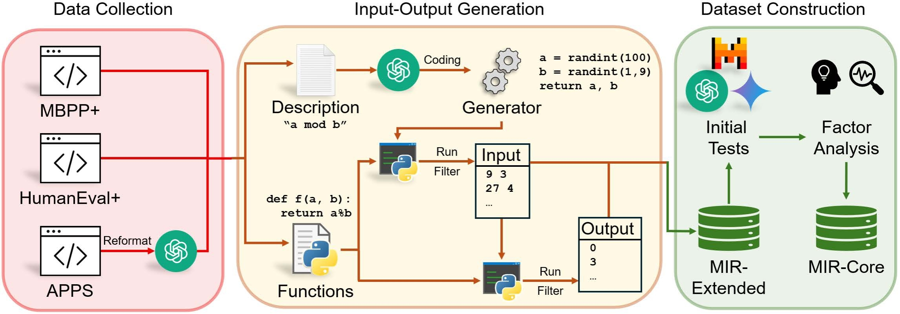

# &#x1F54A; MIR-Bench: Benchmarking LLM's Long-Context Intelligence via Many-Shot In-Context Inductive Reasoning 

[[PDF]](https://arxiv.org/abs/2502.09933)  [[HuggingFace]](https://huggingface.co/datasets/kaiyan289/MIR-Bench)

This repository contains code of the work *MIR-Bench: Benchmarking LLM’s Long-Context Intelligence via Many-Shot In-Context Inductive Reasoning*. The dataset is available at **kaiyan289/MIR-Bench** at huggingface.

Update Feb. 27th 2025: We updated ./eval/data/code_data.parquet, which provides ground truth code and data generator for each problem we published. Please see readme of our huggingface repo for details!

## &#x2728; What is MIR-Bench?

Our proposed benchmark, **M**any-shot **I**nductive **R**easoning Bench (MIR-Bench), is the first many-shot in-context inductive reasoning benchmark. The benchmark is proposed to fix both the problem of existing Inductive Reasoning (IR) benchmarks and many-shot benchmarks. The former only focus on few-shot (usually <10) setting and lack evaluation for aggregating many pieces of information from long contexts, and the latter which are mostly focused on classification only.

Based on MIR-Bench, we study many novel problems for inductive reasoning and many-shot ICL, including robustness against erroneous shots and the effect of Chain-of-Thought (CoT), and acquired many insightful findings. The following figure illustrates the pipeline of our work, where we ask LLM to induce output via input-output examples from underlying functions with diverse data format.



## &#x1F947; Leaderboard

Currently, we benchmark 15 cutting-edge LLMs. All measures are listed in exact match accuracy (0 to 100).

### MIR-Core

Models | 4-Shot | 8-Shot | 16-Shot | 32-Shot | 64-Shot | 128-Shot | 256-Shot | 512-Shot | 1024-Shot | 2048-Shot | Average 
--- | --- | --- | --- | --- | --- | --- | --- | --- | --- | --- | ---
o1-mini-0912 | 62.13 | 68.3 | 70.63 | 70.5 | 71.6 | 72.63 | 71 | 66.87 | 59.53 | 47.53 | 66.07
o1-preview-0912 | 59.07 | 62.3 | 64.53 | 66.07 | 66.97 | 67.07 | 67.9 | 69.4 | 66.97 | 60 | 65.03
Claude-3.5-Sonnet | 48.4 | 54.97 | 58.63 | 61.37 | 61.9 | 62.4 | 62.2 | 61.07 | 56.33 | 58.5 | 58.58
GPT-4o-0806 | 42.97 | 48.97 | 51.87 | 54.37 | 56.77 | 56.67 | 56.7 | 56.23 | 55.23 | 50.56 | 53.03
Gemini-1.5 Pro-002 | 42.03 | 46.9 | 50.2 | 52.4 | 55 | 55.13 | 55 | 54.8 | 53.13 | 48.87 | 51.35
Gemini-1.5 Flash-002 | 41.1 | 45.1 | 48.23 | 50 | 51.4 | 52.8 | 51.7 | 51.7 | 51.63 | 47.63 | 49.13
Gemini-2.0 Flash | 40.3 | 44.83 | 45.67 | 48.33 | 48.36 | 48.53 | 48.67 | 48.27 | 46.07 | 40.97 | 46.0
Claude-3-Sonnet | 31.83 | 38.6 | 39.9 | 44 | 46.03 | 47.07 | 44.8 | 43.53 | 41.3 | 35.97 | 41.3
GPT-4o-mini-0718 | 31.87 | 34.9 | 35.6 | 38.17 | 37.47 | 37.97 | 37.8 | 36.27 | 35.63 | 33.93 | 35.96
GLM-4-Plus | 34.56 | 40.2 | 42.4 | 43.8 | 44.37 | 41.87 | 34.5 | 27.27 | 25.37 | 21.97 | 35.63
Claude-3-Haiku | 25.87 | 29.67 | 32.9 | 33.63 | 37.1 | 40.7 | 39.97 | 39.43 | 37.4 | 35.5 | 35.22
Qwen2-72B-Instruct | 28.77 | 31.73 | 36.07 | 36.57 | 37.27 | 36.83 | 34.77 | 33.87 | 33.97 | 31.07 | 34.09
Mistral-Large-2 | 29.93 | 35.13 | 36.3 | 39.9 | 40.17 | 37.37 | 35 | 28.8 | 25.43 | 12.2 | 32.02
Moonshot-128K | 24.37 | 28.77 | 31.47 | 33.17 | 33.07 | 34.5 | 35.47 | 35.27 | 32.4 | 28.23 | 31.67
Claude-3.5-Haiku | 24.8 | 28 | 27.7 | 26.47 | 26.77 | 24.33 | 21.6 | 16.2 | 12.47 | 9.27 | 21.76

### MIR-Extended

Models | 4-Shot | 8-Shot | 16-Shot | 32-Shot | 64-Shot | 128-Shot | 256-Shot | 512-Shot | 1024-Shot | 2048-Shot | Average 
--- | --- | --- | --- | --- | --- | --- | --- | --- | --- | --- | ---
o1-mini-0912 | 58.34 | 62.87 | 64.91 | 65.15 | 64.43 | 64.93 | 63.39 | 61.03 | 55.44 | 45.32 | 60.58
o1-preview-0912 | 53.33 | 55.69 | 57.04 | 58.46 | 59.46 | 59.99 | 60.52 | 61.21 | 60.01 | 55.37 | 58.11
Claude-3.5-Sonnet | 38.23 | 42.23 | 44.87 | 47.53 | 47.79 | 48.01 | 48.41 | 46.56 | 43.81 | 45.02 | 45.25
GPT-4o-0806 | 31.85 | 35.72 | 37.68 | 38.54 | 39.71 | 40.04 | 39.62 | 39.33 | 38.89 | 36.35 | 37.77
Gemini-1.5 Pro-002 | 31.11 | 33.33 | 34.73 | 35.06 | 35.67 | 36.56 | 36.37 | 36.37 | 35.09 | 32.84 | 34.71
Gemini-1.5 Flash-002 | 29.78 | 31.77 | 33.03 | 33.88 | 34.57 | 35.03 | 35.67 | 34.74 | 34.33 | 32.01 | 33.48
Gemini-2.0 Flash | 29.25 | 31.65 | 31.79 | 33.20 | 32.70 | 33.77 | 33.36 | 32.55 | 31.81 | 28.70 | 31.88
Claude-3-Sonnet | 23.10 | 27.11 | 28.00 | 29.88 | 31.23 | 31.98 | 30.87 | 29.62 | 28.02 | 23.74 | 28.36
GPT-4o-mini-0718 | 24.63 | 25.95 | 26.53 | 27.05 | 26.75 | 26.95 | 26.65 | 25.98 | 25.78 | 24.97 | 26.12
GLM-4-Plus | 26.91 | 29.24 | 29.68 | 30.09 | 30.39 | 29.15 | 24.31 | 21.02 | 21.07 | 16.52 | 25.84
Qwen2-72B-Instruct | 21.51 | 23.74 | 25.89 | 25.96 | 26.18 | 26.12 | 25.50 | 24.23 | 24.76 | 22.31 | 24.62
Claude-3-Haiku | 18.86 | 21.51 | 22.84 | 23.88 | 25.22 | 27.37 | 27.87 | 27.43 | 26.42 | 24.54 | 24.59
Mistral-Large-2 | 23.26 | 26.40 | 27.63 | 28.25 | 28.40 | 27.65 | 24.91 | 21.76 | 18.47 | 9.28 | 23.6
Moonshot-128K |  18.28 | 21.25 | 21.96 | 23.38 | 22.67 | 24.00 | 24.69 | 24.56 | 23.25 | 20.29 | 22.43
Claude-3.5-Haiku | 20.04 | 21.54 | 20.75 | 19.61 | 20.01 | 18.38 | 16.16 | 12.25 | 9.94 | 7.76 | 16.64


## &#x1F4C1;Code Structure

The code are provided in the github repo. Here are the content of each folder:

**./eval:** The folder for evaluation. It also contains data files (whitebox part; see below for details)

**./get_generator:** The folder where we collect data from open-source coding benchmark and extract ground-truth functions. Scripts in it should be the first to run for the whole pipeline (apps_rewrite_step0.py -> read_data_step1.py)

**./get_shots:** The folder where we generate shots using data generators written by GPT-4o-0806. Scripts in it should be the second to run for the whole pipeline (build_dataset_variants_partA_step2.py -> codes_genshot/run.sh -> build_dataset_variants_partA2_step3.py -> build_dataset_variants_partB_step4.py -> codes_exec_output/run.sh)

**./get_prompts:** The folder where we generate final inputs for LLMs in our experiments given shots generated in ./get_shots. Scripts in it should be the last to run. It contains four different folders (duplicate, main-freecotdirect, robust, solverlearner), each for one part of the experiments in our paper.

There are also some auxiliary data given in the repo:

**./get_shots/vgpt/difficulty-gpt.txt:** The file contains normalized difficulty labeled by GPT-4o-0806 with multi-round conversation as mentioned in our paper.

**./get_shots/tag_classification_result_final.txt:** The file contains problem type tags as mentioned in our paper. The raw labeling output can be found in tag_classification_result.csv in the same folder.

**./get_prompts/main-freecotdirect/res:** The folder contains problem indices (as in construct_data_final.parquet) for MIR-Extended (with suffix "all") and MIR-Core (with suffix "quad"). All indices corresponds to the order in ./get_generator/construct_data_final.parquet.

### &#x2757; Downloading large files

Specially, some files are too large to be uploaded in github (and lfs can be costly). We currently use placeholders for these files. To download the actual file, please use the alternative links below, or download them on the huggingface dataset **kaiyan289/MIR-Bench**:

**./get_generator/data/apps/train.jsonl:** https://uofi.box.com/s/7f3zd0cyva6aimraszs9p9kjme7c9816

**./eval/raw_output/GPT4o-0806_lliwt2drxg676152ba/manyshot_benchmark#64acc_quad_512.json:** https://uofi.box.com/s/e5p6t8m0xfqxy6vs0b89u15qzftr1p88

**./eval/data/dataset_whitebox.tar:** https://uofi.box.com/s/v1rf6rwdk7oldvwbawej92576udfznhg.


## &#x2699; Evaluation by Yourself

To prevent possible data contamination from invalidating our benchmark, we only release part of our shots and final prompts (150 out of 300 for MIR-Core, and 400 out of 693 for MIR-Extended). we will refer to the released part as **white box** dataset, and the non-released part as **black box** dataset. We will provide detailed dataset files for the white box part; for the black box part, we will provide scripts for counting scores, functions we used and their difficulty level (without publishing shots, prompts or data generator that produces shots). 

### &#x2B1C; Whitebox

For whitebox part: all data can be accessed at both Huggingface (link to be announced!) and ./eval folder. The data are in .parquet format (recommend to handle with the pandas library), which contains the following columns:

**prompt:** the input for LLMs.

**idx_train:** the index in construct_data_final.parquet and GPT4o-0806.json to identify the exact ground truth function. All indices corresponds to the order in ./get_generator/construct_data_final.parquet.

**idx_test:** the test case number of a given (function, num_shots)-pair. Ranging from 0 to 9.

**plen:** length of prompt.

**num_shots:** number of shots in the prompt.

**ER_rate:** error rate of the shots (always 0 for all data except those for testing robustness).

**tag:** tag for topic of problems.

**difficulty:** difficulty levels labeled by GPT-4o-0806 with multiround conversation.

You need to invoke your LLM and get output for every row with contents in 'prompt' as input, and put LLM's response in 'predict0' column correspondingly. It is OK if the rows are randomly permutated as long as the correspondence is correct. Put the modified file in ./eval. After that, modify evaluate.py accordingly (by filling in DATA_NAME and OUTPUT_FILE) and run evaluate.py.

### &#x2B1B; Blackbox

We will get blackbox evaluation available soon. Stay tuned!

## &#182; Citation

```
@article{yan2025mir,
  title={MIR-Bench: Benchmarking LLM's Long-Context Intelligence via Many-Shot In-Context Inductive Reasoning},
  author={Kai Yan and Zhan Ling and Kang Liu and Yifan Yang and Ting-Han Fan and Lingfeng Shen and Zhengyin Du and Jiecao Chen},
  year={2025},
  journal={arXiv preprint arXiv:2502.09933},
}
```
